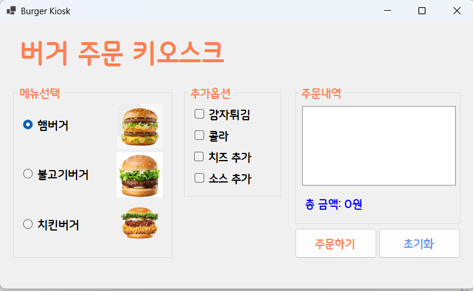

# (C# 코딩) 버거 주문 키오스크 (Burger Kiosk)

## 개요
- C# 프로그래밍 학습
- 1줄 소개: 사용자의 메뉴 및 옵션 선택을 입력받아 총 주문 금액을 계산하고 영수증처럼 내역을 보여주는 버거 주문 키오스크 프로그램입니다.
- 사용한 플랫폼:
  - C#, .NET Windows Forms, Visual Studio, GitHub
- 사용한 컨트롤:
  - Label, ListBox, Button, CheckBox, RadioButton, GroupBox, PictureBox
- 사용한 기술과 구현한 기능:
  - Visual Studio 폼 디자이너를 활용하여 키오스크 UI를 기획하고 컨트롤을 배치했습니다. 채점 기준과 코딩 관례에 따라 모든 컨트롤의 이름은 `btnOrder`, `rbnHam1`, `chkFries`, `lstOrder` 등 기능과 역할을 한눈에 알아볼 수 있도록 명명 규칙(Prefix)을 준수하여 변경했습니다.
  - **RadioButton**을 사용하여 메인 메뉴 중 하나만 고르는 '단일 선택'을 처리하고, **CheckBox**를 사용하여 사이드 메뉴를 중복으로 고르는 '복수 선택(옵션)'을 처리하는 로직을 구분하여 구현했습니다.
  - 조건문(`if`, `else if`)과 컨트롤의 `Checked` 속성을 활용하여 선택된 항목을 판별하고, 해당 가격을 정수형 변수(`totalCost`)에 누적(`+=`) 합산했습니다. 선택된 항목의 이름과 가격은 `Items.Add()` 메서드를 통해 **ListBox**에 순차적으로 기록되도록 처리했습니다.
  - 문자열 보간법(`$`)과 숫자 형식 지정자(`:N0`)를 사용하여 총 금액 데이터를 천 단위 구분 기호(콤마)가 포함된 원화 형식으로 변환해 화면에 깔끔하게 출력했습니다.
  - '초기화' 버튼 클릭 시 모든 컨트롤의 선택 상태를 해제(`Checked = false`)하고 `ListBox`를 비우는(`Items.Clear()`) 초기화 기능을 구현했습니다.

## 실행 화면 (과제1)
- 과제1 코드의 실행 스크린샷

- 과제 내용
  - RadioButton(메뉴 선택용)과 CheckBox(추가 옵션용) 등의 컨트롤을 폼 화면에 적절히 배치하고 GroupBox를 활용하여 시각적, 논리적으로 그룹화합니다.
  - 주문하기 버튼을 누르면 선택된 항목들을 추출하여 주문 내역과 총 금액을 계산해 화면(ListBox, Label)에 표시합니다.
  - 다음 사용자가 다시 주문할 수 있도록 모든 입력 상태를 처음으로 되돌리는 초기화 버튼 기능을 구현합니다.

- 구현 내용과 기능 설명
  - 폼 화면 좌측에는 `GroupBox`와 `RadioButton`을 활용해 버거 메뉴를 하나만 선택하도록 구성하고, 중앙에는 `CheckBox`를 배치해 감자튀김, 콜라 등의 추가 옵션을 다중 선택할 수 있도록 직관적인 키오스크 인터페이스를 구성했습니다.
  - '주문하기' 버튼(`btnOrder`)을 누르면 먼저 `lstOrder.Items.Clear()`를 호출하여 이전 주문 내역을 지웁니다. 이후 각 라디오버튼과 체크박스의 `Checked` 속성(True/False)을 조건문으로 검사하여, 선택된 항목의 문자열을 리스트박스에 한 줄씩 추가하고 가격을 `totalCost` 변수에 합산하도록 구현했습니다.
  - 계산이 끝난 총 금액은 문자열 보간(`$`)과 `:N0` 포맷팅을 적용하여 Label에 출력했습니다. 이를 통해 `8500`이라는 단순 숫자가 아니라 `총 금액: 8,500원`처럼 실제 결제 화면과 유사한 형태로 가독성 높게 표시되도록 처리했습니다.
  - '초기화' 버튼(`btnClear`)을 누르면 코드를 통해 모든 라디오버튼과 체크박스의 `Checked` 값을 `false`로 일괄 변경하고, 리스트박스 화면과 총 금액 라벨 텍스트를 처음 상태로 되돌려 새로운 주문 사이클을 매끄럽게 시작할 수 있도록 조치했습니다.