# (C# 코딩) 버거 주문 키오스크 (Burger Kiosk)

## 개요
- C# 프로그래밍 학습
- 1줄 소개: 사용자의 메뉴 및 추가 옵션 선택을 입력받아 총 주문 금액을 계산하고 내역을 보여주는 버거 주문 키오스크 프로그램입니다.
- 사용한 플랫폼:
  - C#, .NET Windows Forms, Visual Studio, GitHub
- 사용한 컨트롤:
  - Label, ListBox, Button, CheckBox, RadioButton, GroupBox
- 사용한 기술과 구현한 기능:
  - 변수 및 컨트롤 명명 규칙(Naming Rule)을 철저히 준수하여 `btnOrder`, `rbnHam1`, `chkFries`, `lstOrder` 등 기능과 역할을 직관적으로 알 수 있는 이름으로 변경했습니다.
  - RadioButton을 사용하여 메인 메뉴 중 하나만 고르는 단일 선택 로직을, CheckBox를 사용하여 사이드 메뉴를 중복으로 고르는 다중 선택 로직을 구현했습니다.
  - 조건문(if, else if)과 컨트롤의 Checked 속성을 활용하여 선택된 항목을 판별하고, 해당 가격을 정수형 변수(totalCost)에 누적 합산했습니다.
  - 문자열 보간법($)과 숫자 형식 지정자(:N0)를 사용하여 총 금액 데이터를 천 단위 구분 기호(콤마)가 포함된 깔끔한 원화 형식으로 출력했습니다.

## 실행 화면 (과제1)
- 과제1 코드의 실행 스크린샷

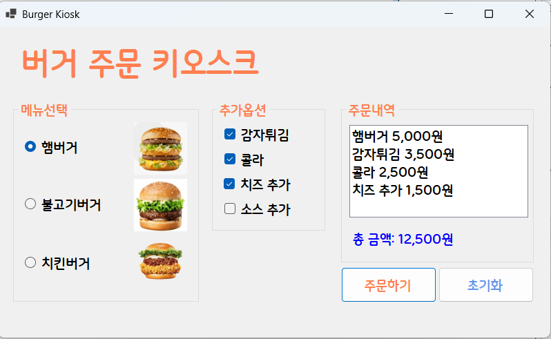

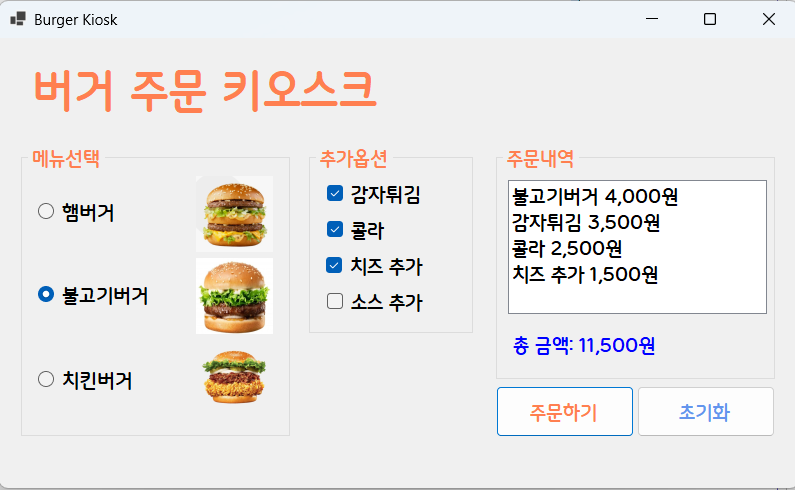

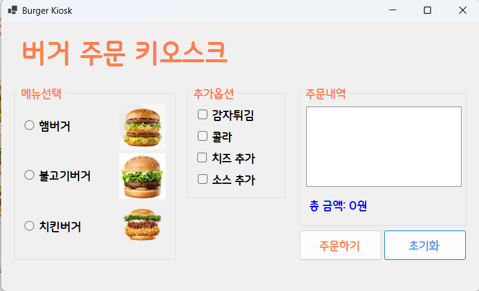

- 과제 내용
  - RadioButton(메뉴 선택용)과 CheckBox(추가 옵션용) 등의 컨트롤을 폼 화면에 적절히 배치하고 GroupBox를 활용하여 시각적, 논리적으로 그룹화합니다.
  - 주문하기 버튼을 누르면 선택된 항목들을 추출하여 주문 내역과 총 금액을 계산해 화면(ListBox, Label)에 표시합니다.
  - 다음 사용자가 다시 주문할 수 있도록 모든 컨트롤의 입력 상태를 처음으로 되돌리는 초기화 버튼 기능을 구현합니다.

- 구현 내용과 기능 설명
  - 폼 화면 좌측에는 버거 메뉴를 단일 선택하도록 RadioButton을 구성하고, 중앙에는 감자튀김, 콜라 등을 다중 선택하도록 CheckBox를 배치해 인터페이스를 구성했습니다.
  - '주문하기' 버튼(btnOrder) 클릭 시 lstOrder.Items.Clear()를 호출하여 이전 내역을 지웁니다. 이후 각 항목의 Checked 속성(True/False)을 검사하여, 선택된 메뉴 문자열을 리스트박스에 Items.Add() 메서드로 순차적으로 기록하고 가격을 합산했습니다.
  - 계산이 끝난 총 금액은 문자열 보간과 :N0 포맷팅을 적용하여, 천 단위 콤마가 적용된 가독성 높은 형태로 Label에 갱신 출력했습니다.
  - '초기화' 버튼(btnClear) 클릭 시, 모든 라디오버튼과 체크박스의 Checked 값을 false로 일괄 변경하고 리스트박스를 완전히 비워 새로운 주문을 받을 수 있도록 처리했습니다.

## 실행 화면 (과제2)
- 과제2 코드의 실행 스크린샷

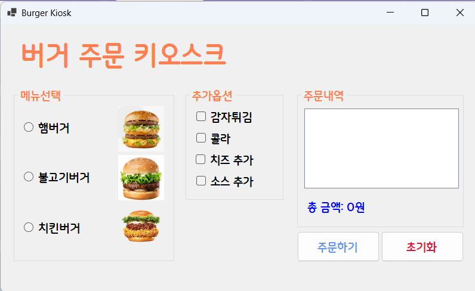

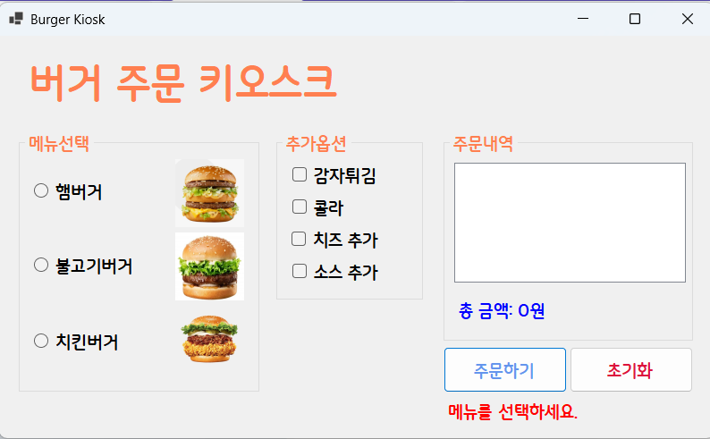

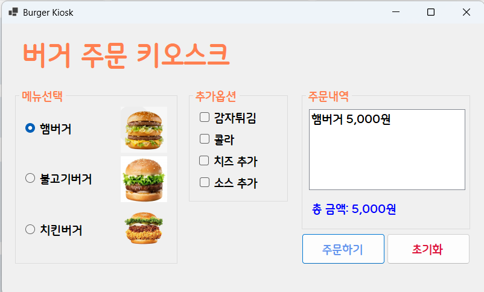

- 과제 내용
  - 아무 메뉴도 선택하지 않고 주문하기 버튼을 누르면 에러 메시지를 표시하는 예외 처리 기능을 구현합니다.
  - 에러 발생 시 별도의 MessageBox 창을 띄우는 대신, 화면 내부의 Label 컨트롤을 활용하여 즉각적이고 직관적인 에러 피드백을 제공합니다.
  - 프로그램을 처음 실행했을 때 특정 라디오버튼이 기본적으로 선택되어 있지 않도록 초기화 처리를 수행합니다.

- 구현 내용과 기능 설명
  - 기존 화면 하단에 붉은색 텍스트로 에러를 안내할 Label 컨트롤(lblError)을 추가로 배치하고, 폼 초기화 시점(public Form1())에 Visible = false 속성을 주어 평상시에는 눈에 보이지 않도록 숨김 처리했습니다.
  - 폼이 로드될 때 실행되는 이벤트 내부에 rbnHam1.Checked = false; 코드를 명시하여, 프로그램이 처음 켜질 때 메인 메뉴가 하나도 체크되지 않은 깔끔한 빈 화면 상태에서 시작되도록 보완했습니다.
  - '주문하기' 로직 최상단에 if (!rbnHam1.Checked && !rbnHam2.Checked && !rbnHam3.Checked) 조건문을 배치하여 메인 메뉴가 모두 미선택 상태인지 검사했습니다.
  - 해당 조건을 만족할 경우 lblError.Visible = true;를 통해 화면에 에러 라벨을 표시하고, return; 문을 사용해 이후의 가격 합산 및 리스트 추가 로직이 아예 실행되지 않도록 코드의 실행 흐름을 안전하게 제어했습니다.

## 실행 화면 (과제3)
- 과제3 코드의 실행 스크린샷

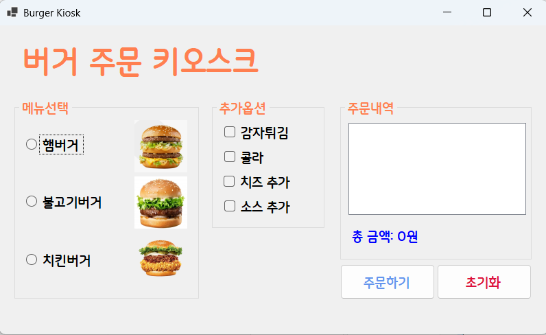

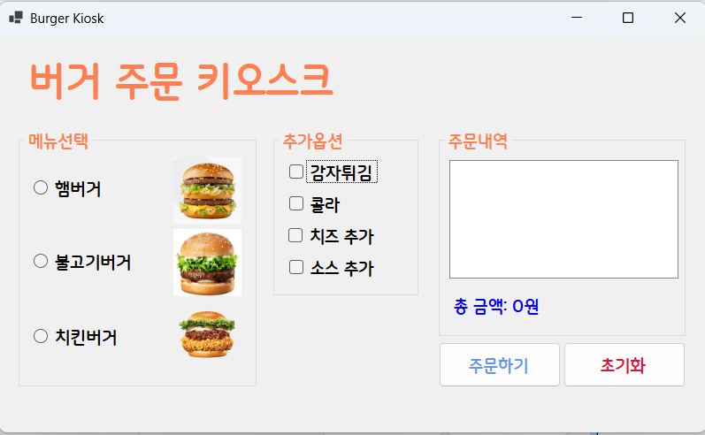

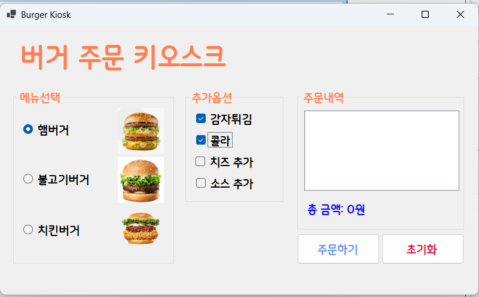

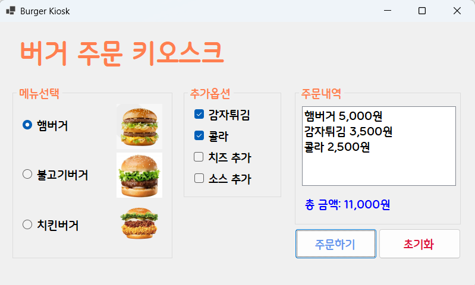

- 과제 내용
  - 마우스 없이 키보드 입력만으로 주문이 가능하도록 사용자 경험(UX)을 개선합니다.
  - Tab 키를 이용하여 GroupBox 사이를 이동하고, 방향키를 이용해 선택 아이템 사이를 이동하도록 만듭니다.
  - 스페이스바를 이용하여 아이템을 선택하고, Enter 키로 주문 버튼을 누를 수 있도록 설정합니다.

- 구현 내용과 기능 설명
  - 화면 디자이너 설정에 의존하지 않고 코드 단(`Form1_Load`)에서 직접 `TabIndex` 속성을 부여하여 탭(Tab) 키 이동 순서를 강제 제어했습니다. 이를 통해 사용자가 Tab 키를 누를 때마다 '메뉴 그룹 -> 추가 옵션 그룹 -> 주문 내역 그룹 -> 주문하기 버튼' 순으로 자연스럽게 포커스가 이동합니다.
  - Windows Forms의 기본 기능을 활용하여 방향키로 라디오 버튼을 이동하고, 스페이스바(Space)로 체크박스를 다중 선택 및 해제할 수 있도록 구성했습니다.
  - 폼의 `AcceptButton` 속성에 `btnOrder`를 할당하여, 메뉴와 옵션을 모두 선택한 뒤 키보드의 Enter 키를 누르면 마우스 클릭 없이도 즉각 주문 계산 로직이 실행되도록 구현했습니다.
  - 프로그램 최초 실행 시, 또는 초기화 버튼(`btnClear`) 클릭 직후 포커스가 라디오버튼에 잡혀 원치 않는 메뉴가 선택되는 것을 막기 위해 `this.ActiveControl = lblTotalCost;` 코드를 추가했습니다.

  ## 실행 화면 (과제4)
- 과제4 코드의 실행 스크린샷

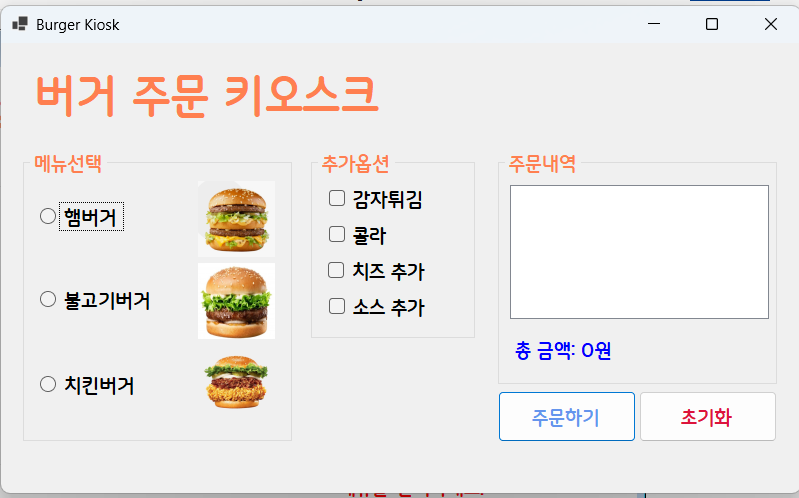

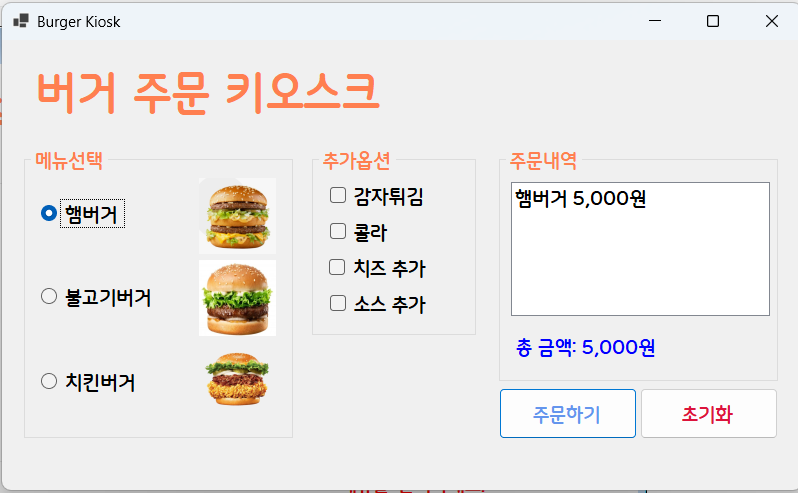

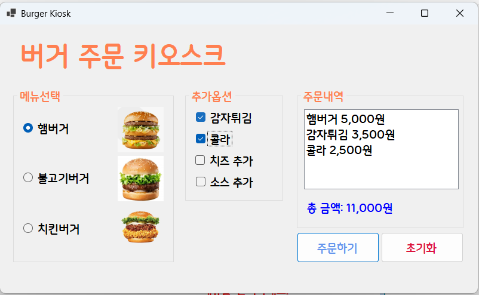

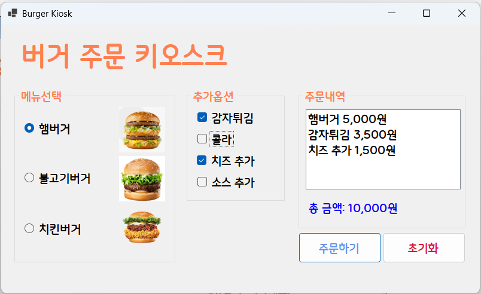

- 과제 내용
  - RadioButton과 CheckBox에서 원하는 항목을 선택하면, '주문하기' 버튼을 누르지 않아도 그 즉시 정보들이 업데이트되도록 기능을 개선합니다.
  - 메뉴를 선택하는 순간 ListBox에 주문 내역(예: 햄버거 5,000원, 콜라 2,500원 등)이 즉각 표시되도록 만듭니다.
  - 메뉴를 선택하는 순간 Label에 전체 가격 정보(총 금액)가 실시간으로 갱신되어 표시되도록 만듭니다.

- 구현 내용과 기능 설명
  - 기존에 주문하기 버튼(`btnOrder_Click`) 이벤트 안에 있던 가격 합산 로직과 ListBox 항목 추가 로직을 `UpdateOrder()`라는 별도의 사용자 정의 메서드로 분리하여 코드의 재사용성과 모듈화를 높였습니다.
  - 폼이 로드될 때(`Form1_Load`), 모든 라디오버튼(메인 메뉴)과 체크박스(추가 옵션)의 상태가 변할 때 발생하는 `CheckedChanged` 이벤트에 `UpdateOrder()` 메서드를 일괄적으로 연결해 주었습니다. 이를 통해 사용자가 항목의 체크 상태를 변경할 때마다 즉시 화면의 내용이 계산되고 갱신되도록 UX를 최적화했습니다.
  - 실시간으로 갱신되는 화면 구조에 맞춰 기존의 '주문하기' 버튼은 계산 역할 대신, 예외 처리(메뉴 미선택 확인) 후 최종 주문 완료를 알리는 확인용 `MessageBox`를 띄우는 역할로 기능과 용도를 알맞게 변경했습니다.